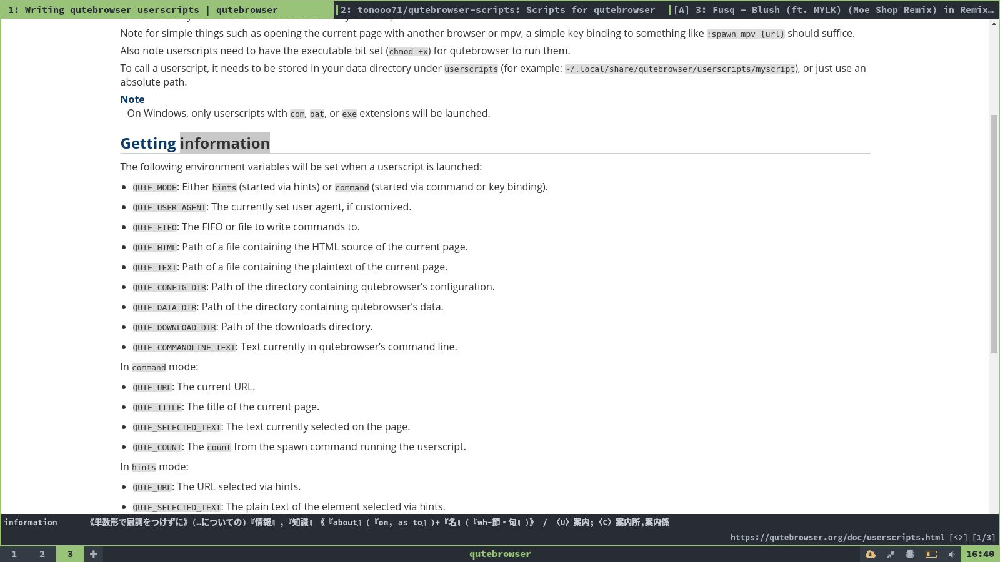

# Scripts for qutebrowser

**usage**

```
: spawn --userscript scripts.sh (command) (option)
```

Scripts are written in Python3 and Bash script.  

## Add articles to pocket

dir: pocket  

You need to get your consumer key and access token.  

## Simple English-Japanese dictionary

dir: ejdict  

When you select an english word on a webpage and execute this script, japanese translated word will be shown in qutebrowser's messege area.

### Requirments

  * [EJDict "ejdic-hand"](https://github.com/kujirahand/EJDict)


